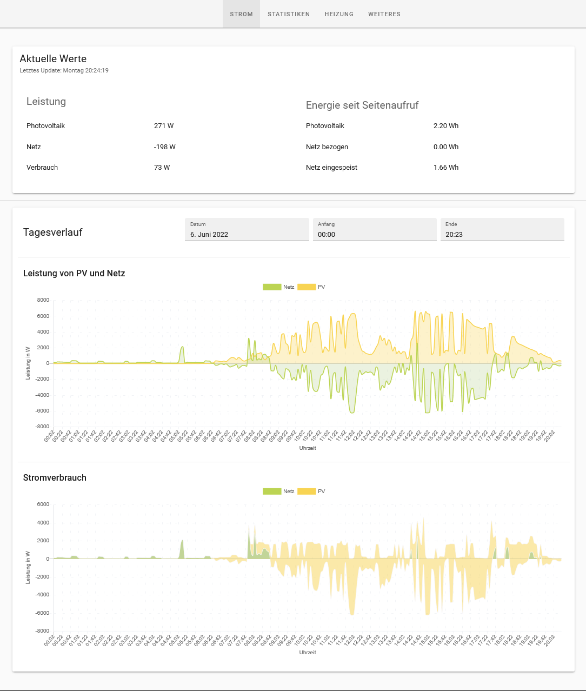

# Solar Logger

A home automation tool for

- tracking power and energy readings of electricity meters using the optical D0 interface
- displaying live power and statistics on a web frontend
- controlling a heating bar based on solar excess power

